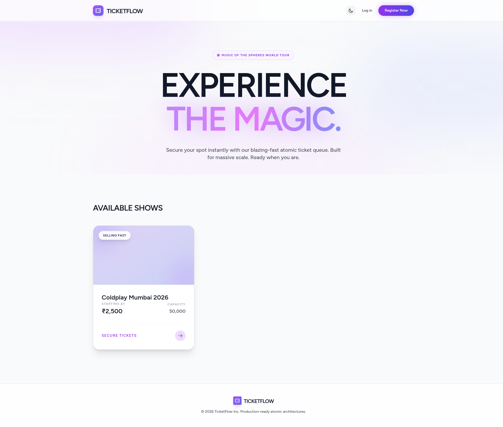
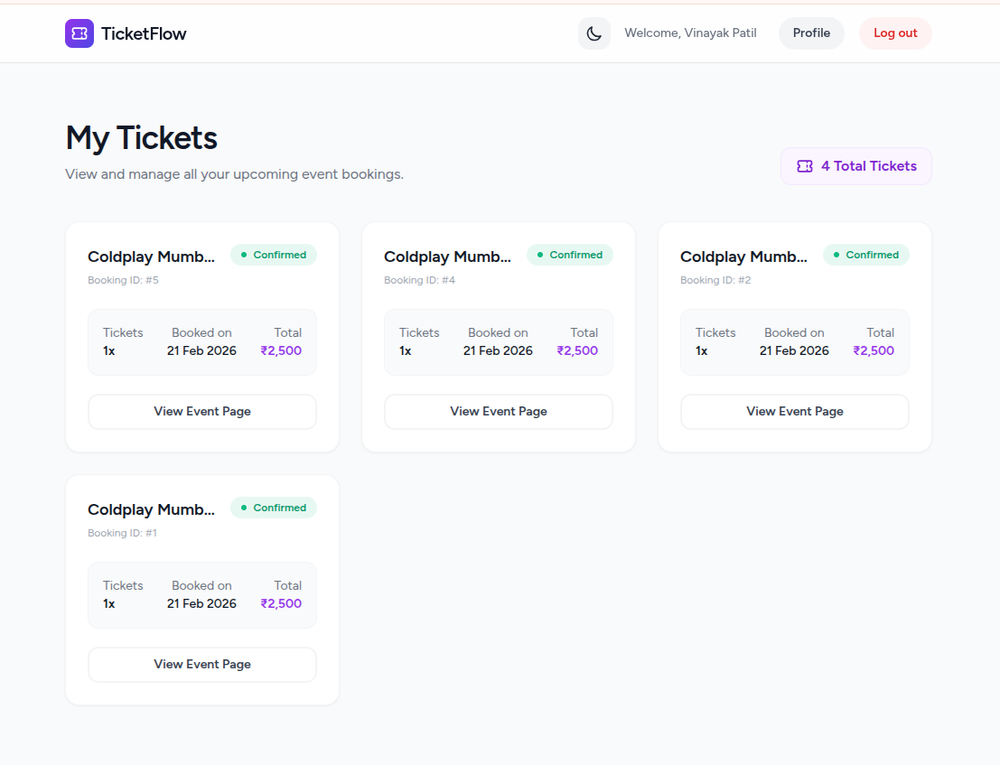
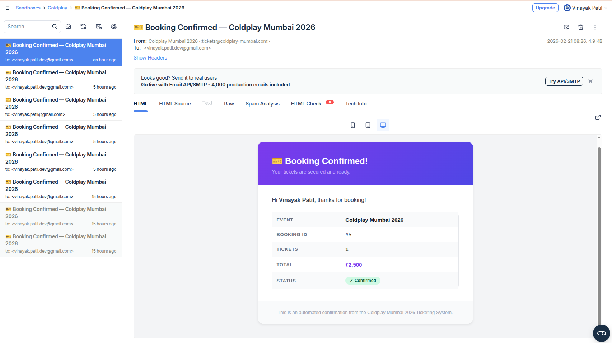
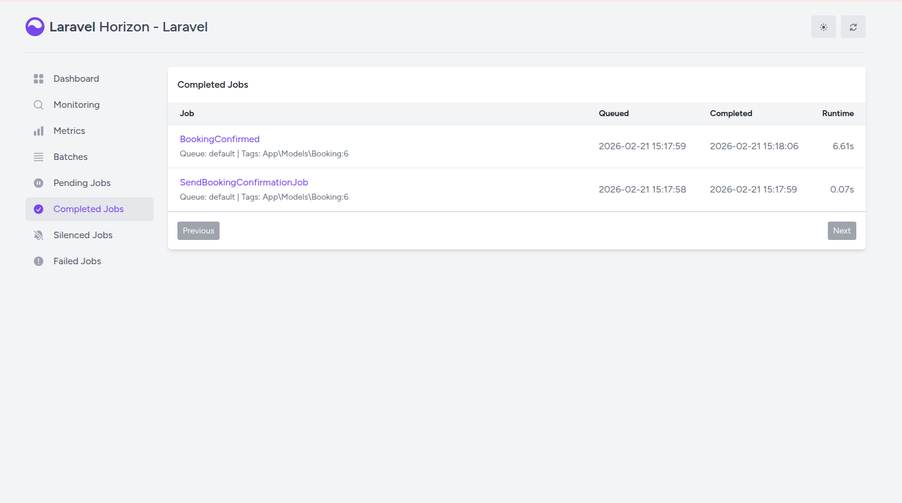

# 🎫 TicketFlow — High-Concurrency Ticketing System

A high-concurrency, modern ticket booking system built with **Laravel**, **React**, **Redis**, and **MySQL**. Designed to handle massive concurrent users with atomic locks, Redis-backed inventory, and strict per-user booking limits. Features a beautifully crafted, fully-responsive dark mode UI.

## Tech Stack

| Layer | Technology |
|---|---|
| Framework | Laravel (PHP 8.2+) |
| Database | MySQL 8.0 |
| Cache / Locks | Redis (via `phpredis`) |
| API Auth | Laravel Sanctum |
| Frontend | React + Inertia.js |
| Styling | Tailwind CSS (Dark Mode / Glassmorphism) |
| Infrastructure | Docker Compose |

---

## Getting Started (Setup Instructions)

Follow these steps to run the project locally via Docker.

### 1. Requirements
- Docker & Docker Compose installed on your machine.

### 2. Environment Setup
Clone the repository and prepare your environment file:
```bash
cp .env.example .env
```
*(Ensure DB and Redis configurations in `.env` match the docker-compose services)*

### 3. Spin up Docker Containers
Start the infrastructure (Nginx, PHP-FPM, MySQL, Redis):
```bash
docker compose up -d
```

### 4. Install Dependencies
Install PHP and Node dependencies inside the app container:
```bash
docker compose exec app composer install
docker compose exec app npm install
```

### 5. Application Key & Migrations
Generate the app key and seed the database with events/inventory:
```bash
docker compose exec app php artisan key:generate
docker compose exec app php artisan migrate:fresh --seed
```

### 6. Build Frontend Assets
Compile the React/TailwindCSS frontend assets:
```bash
# For development/hot-reloading:
docker compose exec app npm run dev

# Or for a production build:
docker compose exec app npm run build
```

**That's it!** The application is now accessible at `http://localhost`.

---

## Running Tests

The application features a comprehensive test suite (49+ tests) covering Authentication, high-concurrency Booking Services, and Profiles.

To run the unit and feature tests:
```bash
docker compose exec app php artisan test
```

To run code-style checks (Pint):
```bash
docker compose exec app ./vendor/bin/pint --test
```

---

## Architecture Overview

**Concurrency Strategy:**
1. **Redis atomic lock** (`Cache::lock('book_event_{id}')`) serialises requests per event to prevent race conditions.
2. **Redis hot inventory** provides O(1) reads and decrements for blazing-fast checkout validation (bypassing heavy DB counts in the hot path).
3. **Database transactions** wrap the actual booking insertion — if the DB fails, the Redis inventory is cleanly rolled back.
4. **Rate limiter** (10 req/min/user) throttles automated bot spam on the booking endpoint.

**Frontend Features:**
- Seamless zero-refresh SPA routing via **Inertia.js**.
- Automatic Intent-based URL redirecting (Intercepts unauthorized checkouts, guides through login, and returns directly to the checkout form).
- Beautiful, animated UI with a dynamic Light/Dark mode toggle (persisted via `localStorage`).

---

## ⚖️ Trade-offs & Architectural Decisions

Building a system to handle the chaos of millions of Coldplay fans within a 24-hour development window requires strict prioritization. The core philosophy of this prototype is **Data Integrity over UI Complexity** and **Availability over Synchronous Processing**.

### 🎯 What I Prioritized (The "Why")
1. **Redis Atomic Locks over Database Transactions:** When millions of users hit the server, using `SELECT ... FOR UPDATE` on a MySQL database creates row-level locking. Under extreme load, this exhausts the database connection pool and leads to deadlocks or crashed servers. I prioritized **Redis** as the single source of truth for inventory during the rush. We acquire an atomic lock (`Cache::lock`), decrement in memory (sub-millisecond), and *then* write to the database.
2. **Asynchronous Feedback (Horizon/Queues):** To keep the user experience "magical" and fast, email confirmations are not sent synchronously. They are pushed to a Redis queue and processed by Laravel Horizon workers in the background. 
3. **API Extensibility:** While I used React/Inertia.js to deliver a modern SPA experience quickly, the core logic is isolated in a `BookingService`. I exposed a separate API route (`/api/bookings`) to prove that a native mobile application can consume the exact same underlying service.

### ✂️ What I Cut (Due to 24-Hour Limit)
1. **Specific Seat Selection:** Allowing users to pick specific seats (e.g., Row A, Seat 12) requires a highly complex database schema and a different locking strategy (locking individual seat rows rather than a global counter). I opted for "General Admission" to focus on the core concurrency problem.
2. **Real Payment Gateway Integration:** Instead of integrating Stripe or Razorpay, I built a `sleep(30)` simulation within the lock. This actually serves a dual purpose: it mocks the payment delay *and* allows us to easily test our concurrency locks by firing simultaneous requests in development.
3. **WebSockets for Real-Time Inventory:** In a perfect world, the "Tickets Remaining" UI would update via WebSockets (Laravel Reverb). Due to time constraints, I relied on state injection on page load and basic polling/React state.

### 🚀 How I Would Scale This for Production
If this were the real Coldplay launch going live to 5 million fans tomorrow, the current single-node Docker setup would not survive. Here is the production scaling strategy:

1. **The Stampeding Herd (Virtual Waiting Room):**
   
   No server can handle 5 million concurrent POST requests. I would implement a Cloudflare Waiting Room or Queue-it integration at the edge/CDN level. This throttles traffic, allowing only a manageable batch of users (e.g., 10,000 per minute) to access the actual booking application.
2. **Infrastructure Distribution:**
   * **App Servers:** Move from a single container to an auto-scaling group (e.g., AWS EKS or ECS) behind an Application Load Balancer.
   * **Database:** Implement MySQL Read Replicas to handle the read-heavy load of users viewing the event page, keeping the primary database strictly for the write-heavy `bookings` table.
   * **Redis Cluster:** Use a managed, highly available Redis Cluster (like AWS ElastiCache) to ensure the atomic locks never fail due to a single node going down.
3. **Event-Driven Booking Processing:**
   Instead of keeping an HTTP request open while processing a ticket, I would transition to a fully event-driven architecture (e.g., AWS SQS or Kafka). The user clicks "Book", their request goes to a queue, the UI shows a "Processing..." polling screen, and the backend workers grind through the queue at maximum safe capacity.


## Screenshot

### Landing Page


### My Tickets


### Mailtrap


### Horizon
